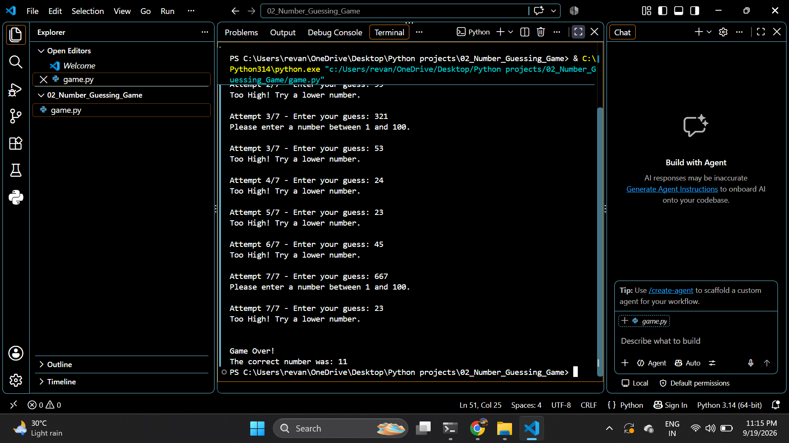

# 🎯 Number Guessing Game
A simple beginner-friendly Python game where the computer randomly selects a number between **1 and 100**, and the player has **7 attempts** to guess the correct number.
## 🚀 Features
- 🎲 Random number generation
- 🔢 Number between 1 and 100
- ❤️ 7 attempts
- ⬆️ "Too Low" hint
- ⬇️ "Too High" hint
- ❌ Input validation
- 🏆 Winning message
- 💻 Simple command-line interface
## 🛠️ Technologies Used
- Python
- Random module
## ▶️ How to Run
Clone the repository:
```bash
git clone https://github.com/revanth1461/Python-Projects.git
## 🖥️ Game Preview

